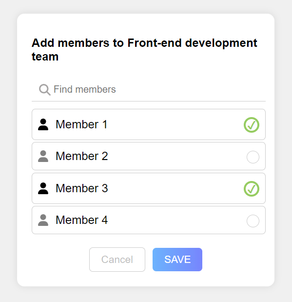

# Simple Mockup React Task (Non-Functional)

This is a simple mockup React task representing a non-functional design for adding members to a Front-end development
team.

This project was bootstrapped with [Create React App](https://github.com/facebook/create-react-app).

## Running the Application

To run this React application locally, follow these steps:

1. Clone the repository to your local machine.
   ```bash
   git clone https://github.com/Mohammad-AbuJaber/simple-mockup-react-task--non-functional.git
    ```
2. Navigate to the project directory.
   ```bash
   cd simple-mockup-react-task--non-functional
   ```
3. Install the project dependencies.
   ```bash
    npm install 
    ```
4. Run the application.
   ```bash
    npm start
    ```
   The application will be running at http://localhost:3000.

# About the Design

This project provides a simple React design featuring the following components:

1. **ParentComponent:** The main parent component that includes a title, a search bar, a member list, and buttons.
2. **SearchBar:** A component with a search icon and an input field to search for members.
3. **MemberList:** A component displaying a list of members with checkboxes.
4. **Buttons:** A component containing cancel and save buttons.
   The components are styled using CSS to achieve a basic non-functional mockup for adding members to a front-end
   development team.

<div align="center">
  
</div>

Feel free to explore and modify the components and styles to suit your needs or integrate functionality to make it fully
functional.
